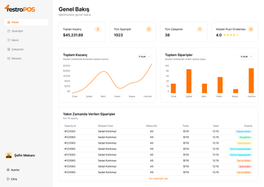

# RestroPOSv2

# 1. GİRİŞ

Teknolojinin hızlı evrimi ve dijital araçların yaygınlaşması, çağdaş toplumun ve işletmelerin dijital dönüşümünde belirleyici bir etkiye sahiptir. Günümüzde neredeyse her bireyin, internete bağlı akıllı cihazlara erişimi bulunmakta ve bu cihazlar, iletişim kurma ve günlük işleri hızlı bir şekilde gerçekleştirmek için artık temel araçlar haline gelmiştir. Bu dijital dönüşüm, sadece bireylerin ve işletmelerin günlük yaşamlarını kolaylaştırmakla kalmaz, aynı zamanda yeni iş modellerinin ortaya çıkmasına ve geleneksel endüstrilerin dönüşümüne de yol açar.

Dijital dönüşüm süreci birçok sektörde önemli değişimlere sebep olmuştur. Özellikle insanlarla iletişimin ve müşteri memnuniyetinin en ön planda olduğu hizmet sektöründe dijitalleşme ve teknolojinin kullanımı iş modellerini ve iş süreçlerini doğrudan etkilemiştir. Bu noktada, restoran işletmeleri de dijital dönüşümün etkisini yoğun bir şekilde hissetmektedir.

Restoran endüstrisi, geleneksel işletme yönetimi pratiklerinden dijitalleşme sürecine doğru hızla ilerlemektedir. Bu değişim, müşteri memnuniyetini artırmak ve maliyetleri azaltmak amacıyla çeşitli dijital çözümlere yatırım yapmayı içermektedir. Özellikle son üç yılda, restoranların %87'sinin müşteri beklentilerini karşılamak için dijital teknolojilere yatırım yaptığı gözlemlenmiştir (Publicis Sapient, 2023).

Restoran sektörü, dijitalleşme ve mobil teknolojilerin sunduğu olanaklardan yararlanarak iş süreçlerini iyileştirme eğilimindedir. Bu dönüşümün bir parçası olarak, müşteri deneyimini artırmak amacıyla çeşitli dijital çözümler benimsenmektedir. Örneğin, mobil uygulamalar müşteri tercihlerini kaydederek kişiselleştirilmiş öneriler sunabilir ve bu da müşteri memnuniyetini artırabilir. QR menü sistemleri ve online sipariş platformları gibi araçlar, müşterilere daha hızlı ve kolay bir şekilde erişim sağlayarak işletmenin etkinliğini artırabilir.

Özellikle COVID-19 salgınıyla birlikte, fiziksel teması azaltmak amacıyla QR kod tabanlı menülerin popülerliği artmıştır ve bu trend pandemi sonrasında da devam etmektedir (Danielle Wiener-Bronner, 2022). Geleneksel kağıt menülerin yerine dijital QR kod menülerin tercih edilmesi, çevresel sürdürülebilirlik açısından önemli bir adımdır. Bu dijital menülerin benimsenmesi, kağıt ve mürekkep israfının azaltılmasını sağlayarak çevre üzerinde olumlu bir etki yaratmaktadır. Bu durum, işletmelerin hem çevresel etkilerini azaltarak sürdürülebilir bir iş modeli oluşturmalarına hem de müşteri memnuniyetini artırarak rekabet avantajı sağlamalarına olanak tanımaktadır.

Selcen Öztürkcan ve Olgun Kitapçı'nın yaptığı araştırma (2023), QR menülerin sürdürülebilirlik açısından önemli bir avantaj sunduğunu gösteriyor. Bu çalışma, geleneksel menülerin yerini alan QR kod tabanlı menülerin, restoran işletmelerinin çevresel etkilerini azaltmalarına yardımcı olduğunu vurgulamaktadır. Bu nedenle, restoranlar QR menülerin benimsenmesiyle birlikte sürdürülebilirlik ve müşteri memnuniyeti gibi önemli alanlarda kazanç elde edebilirler. Bu durum, işletmelerin hem çevresel etkilerini azaltarak sürdürülebilir bir iş modeli oluşturmalarına hem de müşteri memnuniyetini artırarak rekabet avantajı sağlamalarına olanak tanımaktadır.

Restoranların dijital dönüşümü, yalnızca müşteri deneyimini değil, aynı zamanda işletme içi operasyonları da kapsamlı bir şekilde etkilemektedir. Sipariş yönetim sistemi, menü düzenleme aracı ve veri analitiği gibi dijital araçlar, işletmelerin iş süreçlerini optimize etmelerine ve verimliliklerini artırmalarına olanak tanımaktadır. Bu teknolojiler, maliyetleri azaltarak işletmelerin karlılığını artırmakta ve restoranların rekabet avantajı elde etmelerine imkan tanımaktadır.

Küçük işletmeler, restoran sektörünün büyük bir kısmını oluşturmaktadır. Munir Mandviwalla ve Richard Flanagan'ın yaptığı bir araştırmaya (2021) göre, küçük işletmelerde dijital dönüşüm, müşteri artışı ve gelir artışı gibi olumlu sonuçlar doğurmaktadır. Bu sebeple, dijital dönüşüm, küçük işletmeler için yalnızca operasyonel verimlilik sağlamakla kalmayıp, aynı zamanda gelir artışı açısından da büyük önem taşımaktadır.

Ancak, günümüzde dijital dönüşüm, küçük ve orta ölçekli işletmeler için maliyetli olabilmektedir. Restoranlar için geliştirilen mevcut teknolojik çözümler genellikle karmaşık, kurulumu zor ve yüksek maliyetli olmaktadır. Bu durum, küçük ve orta ölçekli işletmelerin büyük işletmelerle rekabet edememesine yol açmaktadır. Dijital dönüşümün bu engelleri, küçük ve orta ölçekli işletmelerin büyüme ve gelişme potansiyelini sınırlamaktadır.

Bu araştırma, küçük ve büyük tüm restoran işletmeleri için tüm akıllı aygıtlarda çalışabilen, kurulumu basit ve bulut tabanlı bir restoran sipariş yönetimi ve QR menü sisteminin mevcut teknolojik çözümlere alternatif olarak geliştirilmesini ele almaktadır. Geliştirilen bu ürünün, restoranların dijital dönüşümüne katkı sağlaması, verimliliklerini artırması ve rekabet avantajı elde etmelerini hedeflemektedir. Ayrıca, bu sistemin düşük maliyetli ve kullanıcı dostu yapısı, küçük ve orta ölçekli işletmelerin büyük işletmelerle eşit şartlarda rekabet edebilmelerine olanak tanıyacaktır.

Özetle, restoran sektöründe dijital dönüşümün önemini vurgulamakta ve bu dönüşümü her ölçekteki işletme için erişilebilir kılacak yenilikçi çözümler sunmayı amaçlamaktadır. Bu sayede, restoranların hem operasyonel verimliliklerini artırmaları hem de müşteri memnuniyetini maksimize etmeleri mümkün olacağı düşünülmektedir.

# 2. GELİŞTİRİLEN ÜRÜNÜN İNCELENMESİ

Araştırmamızda geliştirdiğimiz restoran sipariş yönetimi ve QR Menü sisteminin ismine RestoPOS verdik. Bu bölümde RestroPOS’un özelliklerinden, işletmelere ve müşterilerine sağladığı faydaları ele alacağız.

RestroPOS, restoran işletmelerinin ihtiyaçlarını karşılamak, erişilebilirlik sağlamak ve hızlı bir şekilde kurulabilmek üzere tasarlanmış bir sistemdir. Günümüzün dijitalleşen restoran yönetimi süreçlerinde, RestroPOS kullanıcı dostu arayüzü ve kapsamlı özellikleri ile dikkat çekmektedir. Sistemin temel özellikleri arasında, müşterilere üstün bir deneyim sunma ve restoran sipariş ve yönetim süreçlerini dijital araçlarla etkin bir şekilde yönetme yer almaktadır.

RestroPOS’un sunduğu süreç şu şekildedir:

1. **QR Kod ile Menüye Erişim:** Müşteri, masaya oturduğunda QR kodunu okutarak dijital menüye erişir.
2. **Ürün Seçimi ve Sipariş Oluşturma:** Müşteri, dilediği ürünleri seçerek sepetine ekler ve sipariş oluşturur.
3. **Siparişin Garsonlara İletilmesi:** Oluşturulan sipariş garsonlara iletilir. Garsonlar siparişi onayladıktan sonra, sipariş mutfağa iletilir.
4. **Siparişin Hazırlanması:** Mutfak ekibi, ekrandan sipariş içeriğini görerek siparişi hazırlar ve sipariş durumunu günceller.
5. **Siparişin Teslim Edilmesi:** Garsonlar, sistem üzerinden siparişin hazırlandığına dair bildirim alır ve siparişi müşteriye teslim eder.
6. **Ödeme ve Sipariş Kapatma:** Müşteri, siparişin servis edilmesinden sonra restorandan ayrılırken hesabı ödemek için kasaya gider. Kasa ödemeyi alır ve siparişi kapatır.

Bu süreçler, RestroPOS üzerinden canlı bir şekilde yönetilebilir. Sistem, sipariş sürecini operasyonel olarak basitleştirir ve olası karmaşıklıkları önler. Böylece müşterilere olumlu bir sipariş deneyimi sunulur.

Bu ürünü geliştirilirken 2 farklı kullanıcı tipine göre ekranlar ele alındı. Bu kullanıcılar şu şekilde;

- Restoran yönetici ve çalışanlar
- Restoran müşterileri

Bu iki kullanıcı grubunun ihtiyaçları dikkate alınarak, arayüzler hem yönetim hem de müşteri deneyimini iyileştirecek şekilde yapılandırılmıştır. Restoran yöneticileri ve çalışanları için tasarlanan ekranlar, iş süreçlerinin kolay ve etkin bir şekilde yönetilmesini sağlarken, müşterilere yönelik ekranlar ise kullanıcı dostu ve anlaşılır bir menü yapısı sunarak, sipariş süreçlerini basitleştirmektedir.

## 2.1 Restoran Yöneticisi ve Restoran Çalışanları

RestroPOS sistemi, her bir restoran için özel bir çalışma alanı sunarak işletme sahiplerine benzersiz bir yönetim deneyimi sağlar. Bu çalışma alanları, restoran yöneticileri tarafından sisteme kaydedilerek oluşturulabilir. Kayıt süreci iki aşamalıdır ve Şekil 2.1(a) ve Şekil 2.1(b)'de gösterildiği gibi ilerlemektedir. İlk adımda, restoran sahibi kişisel bilgilerini ve bir şifre belirler. İkinci adımda ise işletmenin logosu, adı ve özelleştirilmiş bir alan adı belirlenir. RestroPOS'a birden fazla işletme kaydedilebilir ve her biri kendine özgü bir çalışma alanıyla yönetilebilir.

Şekil 2.1 Restoran yönetici kayıt ekranları a) Kayıt ekranı ilk adım, b) Kayıt Ekranı ikinci adım.

İşletme sahibi, sisteme kaydolduktan sonra, istediği zaman özel olarak oluşturulmuş URL ile (Örn: ornek-isletme.restropos.software) işletmesine giriş yapabilir.

Restoran çalışanları ise, bağlı oldukları işletmenin URL'i ile sisteme giriş yapabilirler ancak öncesinde restoran sahibinin çalışanlarını sistemde tanımlaması gerekmektedir. Şekil 2.2'de gösterilen ekrandan, restoran sahibi çalışanların temel bilgilerini, şifrelerini ve rollerini belirleyerek sisteme kaydedebilir. Ayrıca, çalışanların bilgilerini güncelleyebilir veya silebilir.

Şekil 2.2. Restoran çalışan listesi ekranı.

Restoran sahibi ve çalışanlar, aynı giriş ekranından sisteme giriş yaparlar ancak rollerine göre kullanıcıların yetkileri ve erişebildikleri ekranlar değişebilir.

Yönetici ekranları, restoran sahibinin erişebileceği en kapsamlı ekranlardır. Bu ekranlarda Siparişler, Menü, Çalışanlar, Masalar, Değerlendirmeler ve Ayarlar gibi bölümler bulunmaktadır.

### 2.1.1 Yönetici ekranı: siparişler

Siparişler ekranında (Şekil 2.3), restoran sahibi canlı olarak aktif siparişleri izleyebilir. Ayrıca, geçmiş siparişlerini görüntüleyebilir ve detaylı bir şekilde filtreleyebilir.

Sipariş ekranı, restoran sahibinin işletmesinden farklı bir ortamda bulunsa bile, restoranın yoğunluğu hakkında anlık bilgi sahibi olmasını sağlar. Ayrıca, sipariş süreçlerini detaylı bir şekilde inceleyebilmesi, bir aksilik olduğunda veya olağandışı bir durumda fark edebilmesine yardımcı olabilir.

Şekil 2.3. Siparişler ekranı.

### 2.1.2 Yönetici ekranı: menü

Menü ekranında (Şekil 2.4), üç sekme bulunmaktadır: öne çıkarılan ürünler, kategoriler ve tüm ürünler. Tüm ürünler sekmesinde, restoran sahibi menüde gösterilecek olan ürünleri ekleyebilir, ürünleri listeleyebilir ve detaylı bir şekilde filtreleyebilir. Kategoriler sekmesinde, menüdeki kategoriler ve bu kategorilerin fotoğrafları yer alır. Restoran sahibi aynı şekilde bu kategorileri ekleyip çıkarabilir ve görüntüleyebilir. Kategoriler, restoran müşterilerine aradıkları ürünleri bulmalarında yardımcı olur. Çünkü QR menü üzerinden seçilen kategorilere göre filtreleme yapılabilmektedir. Öne çıkarılan ürünler sekmesinde ise başlıklar ve o başlık altında gösterilecek ürünler listelenir. Bu ekranda restoran sahibi, QR menüde müşterilerinin dikkatini çekmek istediği ürünleri seçebilir; örneğin, promosyon veya indirimdeki ürünler gibi. Bu özellik, müşterilere kişiselleştirilmiş bir deneyim sunmak için oldukça değerlidir. Ayrıca kolay yönetilebilirliği ile anlık menü değişiklikleri gerçekleştirilebilir.

Şekil 2.4. Menü ekranı.

### 2.1.3 Yönetici ekranı: masalar

Masalar ekranında (Şekil 2.5), restoran sahibinin oluşturduğu QR kodları bulunmaktadır. Restoran sahibi ayrıca masa isimlerini girerek masalar için QR kodları oluşturabilir. Sistem, her masaya özel bir QR kod oluşturur. Müşteriler bu QR kodları kullanarak restoranın menüsüne erişebilirler. Ayrıca, QR menüler sayesinde siparişlerde masa takibi yapılabilir. Restoran çalışanları, hangi müşterinin hangi masadan sipariş verdiğini görebilirler. Bu sayede, siparişlerin hangi masaya ait olduğunu anlamak daha kolay olur ve restoran operasyonları daha sorunsuz bir şekilde yürütülebilir.

Şekil 2.5. Masalar ekranı.

### 2.1.4 Yönetici ekranı: incelemeler

İncelemeler ekranı (Şekil 2.6), müşterilerin restorana yaptığı yorumları ve değerlendirmeleri listeler. Restoran sahibi, müşterilerinin fikirlerini ve değerlendirmeleri bu ekran üzerinden detaylıca inceleyebilir ve istatistiksel bilgilere erişebilir. Bu sayede, müşterilerden etkili bir geri bildirim alınabilir ve restoranın hizmet kalitesi hakkında önemli bilgiler elde edilmesini sağlar.

Şekil 2.6. İncelemeler ekranı.

### 2.1.5 Çalışan ekranları: garson

Garson rolündeki çalışanlar, sistem üzerinden müşterilerin verdikleri siparişleri alabilir ve hazırlandıktan sonra müşterilere servis edebilirler. Garson ekranları, mobil cihazlara uygun şekilde tasarlanmıştır (Şekil 2.7(a) ve Şekil 2.7(b)), bu sayede garsonlar sadece telefonları ile sisteme giriş yaparak siparişlerin takibini yapabilirler.

Siparişlerin bu şekilde sistem üzerinden ilerletilmesi, garsonlar arasında senkronizasyon problemlerini ve olası karmaşaları önleyebilir. Çalışanlar, daha optimize ve düzenli bir şekilde işlerini kolaylıkla gerçekleştirebilirler. Ayrıca bu sistem, müşterilere daha hızlı servis hizmeti ve sipariş deneyimi sunulmasını sağlar.

Şekil 2.7. Garson ekranları a) Atanmış siparişler ekranı, b) Aktif siparişler ekranı.

### 2.1.6 Çalışan ekranları: mutfak

Mutfak ekranı (Şekil 2.8), mutfakta çalışan personelin gelen siparişleri takip etmesine ve müşteri isteklerine göre ürünleri hazırlamalarına yardımcı olur. Bu ekranda, siparişlerin ne zaman geldiği, sipariş içeriğinde hangi ürünlerin ve hangi varyasyonlarda hazırlanması gerektiği gibi detaylar görüntülenebilir. Bu sayede, mutfakta oluşabilecek karmaşanın önüne geçilir ve iş akışı daha düzenli hale gelir.

Ayrıca, hazırlanan siparişler bu ekrandan işaretlenerek garsonlara anlık güncelleme bildirimleri yapılabilir.

Şekil 2.8. Mutfak ekranı.

### 2.1.7 Çalışan ekranları: kasa

Hazırlanan siparişler servis edildikten sonra ödemesi alınabilir. Ödeme aşaması kasa ekranlarında gerçekleştirilir. Kasada çalışan personeller, bu ekran (Şekil 2.9) üzerinden işletmedeki masaların durumunu görüntüleyebilir. Ayrıca masadaki siparişlerin detaylarını ve siparişlerin hangi müşteriye ait olduğunu görebilirler. Kasa çalışanları, siparişlerin ödenme durumunu bu ekrandan kontrol eder.

Bu sistemin restoran ve müşteri için birçok faydası bulunmaktadır. Restoran açısından, kasa işlemlerinin dijital olarak takip edilmesini sağlar. Siparişlerin ve ödemelerin durumu anlık olarak görüntülenebilir, bu da yönetim ve hesaplama hatalarını minimize eder.

Müşteriler açısından ise, ödemelerin hızlı ve doğru bir şekilde yapılması, genel müşteri memnuniyetini arttırır. Ayrıca, sipariş detaylarının kasa çalışanları tarafından kolayca görüntülenebilmesi, herhangi bir karışıklık olmadan doğru siparişlerin doğru müşterilere faturalandırılmasını sağlar. Bu da müşterilere daha profesyonel ve güvenilir bir hizmet sunar.

Şekil 2.9. Kasa ekranı.

## 2.2 Müşteri Ekranları

Müşteriler, restoranda oturdukları masada bulunan QR kodu okutarak restoranın menüsüne erişirler. Ancak menü ekranına girmeden önce müşterinin yetkilendirilmesi gerekmektedir. Müşteri deneyimi açısından bu giriş akışının basit tutulması oldukça önemlidir. Bu nedenle, kullanıcı dostu bir giriş akışı oluşturulmuştur. İlk adımda müşterinin telefon numarasını girmesi gerekmektedir (Şekil 2.10(a)). Eğer bu telefon numarasıyla müşteri kaydı sistemde bulunuyorsa, müşterinin telefonuna altı haneli tek kullanımlık bir şifre gönderilir ve bu şifreyle müşteri menüye erişebilir. Eğer müşterinin kaydı bulunmuyorsa, temel bilgilerini girerek kayıt oluşturulur. Bu basit akış sayesinde müşteri çok beklemeden ürünleri görüntüleyebilir ve istediği ürünü sipariş edebilir. Ayrıca, bu kayıtlar RestroPOS kullanılan tüm restoranlarda tutulur, böylece müşterinin her restoran için tekrar kayıt olmasına gerek kalmaz.

QR Menü, Ana Ekran, Arama, Siparişler ve Sepetim olmak üzere dört sekmeden oluşur.

Ana Ekranda (Şekil 2.10(b)), müşteriye bulunduğu restoran hakkında bilgi verilir. Müşteri, restoranın incelemelerini ve değerlendirmelerini buradan inceleyip restoran hakkında bilgi sahibi olabilir. Ekranın devamında ise restoranın öne çıkardığı ürünler ve bu ürünlerin başlıkları bulunur.

Arama ekranında kategoriler ve arama çubuğu görünür. Bu ekranda tüm ürünlere göz atılabilir, bu da müşterinin aradığı ürünü hızlıca bulmasını sağlar.

Siparişler ekranında (Şekil 2.10(c)) müşteriler aktif siparişlerini ve durumlarını görüntüleyebilir. Ayrıca geçmiş siparişlerini görüntüleyip dilerse siparişini değerlendirebilir. Bu ekranlar sayesinde müşteri siparişini canlı olarak takip edebilir.

Müşteri, siparişinin durumunu anlık olarak takip edebilir ve böylece bekleme süresi hakkında bilgi sahibi olur. Bu, müşteri memnuniyetini artırır ve restoranın hizmet kalitesini yükseltir. Restoran açısından ise, siparişlerin durumunu anlık olarak izlemek, verimliliği artırır ve olası sorunların önüne geçer.

Sepetim ekranında (Şekil 2.10(d)), müşterinin sepetine eklediği ürünler görüntülenir. Müşteri sepetini istediği gibi güncelleyebilir ve siparişini oluşturabilir. Bu ekran, müşterinin siparişlerini kolayca yönetebilmesini ve değiştirebilmesini sağlar, bu da sipariş sürecini daha esnek ve kullanıcı dostu hale getirir.

Şekil 2.10. a) Telefon numarası ekranı, b) Ana ekran, c) Siparişler ekranı, d) Sepetim ekranı.

## 2.3 Sonuç ve Faydalar

RestroPOS'un tasarımı ve özellikleri incelendiğinde, basitliğin ön planda tutulduğu görülmektedir. Restoranlar için mevcut dijital çözümler genellikle kurulumu zor, arayüzleri karmaşık ve kullanıcılar tarafından anlaşılması güç sistemler içermektedir. RestroPOS, bu sorunlara çözüm getirmeyi ve restoranlara alternatif bir seçenek sunmayı amaçlamaktadır. Özellikle QR menü ve sipariş akışının kullanıcı dostu olması, işletmeler açısından büyük önem taşımaktadır.

Yapılan bir anket (Publicis Sapient, 2023), müşterilerin %50'sinin menüyü incelemek için telefonlarını kullandığını göstermektedir. Aynı ankette, müşterilerin genellikle bu sistemlerin yetersizliği, anlaşılması ve kullanılması zor menülerden şikayetçi oldukları belirtilmiştir. Bu durum, restoran işletmelerinin müşteri kaybetmesine yol açmaktadır.

RestroPOS, kullanıcı dostu arayüzü ve basit kurulum süreciyle bu problemlere çözüm sunarak, restoran işletmelerinin verimliliğini artırmayı hedeflemektedir. QR menü sistemi ve kolay sipariş akışı, müşterilerin deneyimini iyileştirmekte ve memnuniyeti artırmaktadır. Bu bağlamda, RestroPOS, hem işletmelerin hem de müşterilerin ihtiyaçlarına yanıt veren etkili bir dijital çözüm olarak öne çıkmaktadır.

# 3. GELİŞTİRME SÜRECİ

Bu bölümde, restoran işletmeleri için dijital dönüşümü daha erişilebilir ve düşük maliyetli hale getirmek amacıyla geliştirilen bulut tabanlı web uygulaması RestroPOS'un geliştirme süreci ayrıntılı bir şekilde ele alınacaktır. RestroPOS, küçükten büyüğe her türlü restoran işletmesinin tüm operasyonel süreçlerini bulut tabanlı bir web uygulaması üzerinden yönetmesini ve müşterilere QR menü ile sipariş verme imkanı sunmasını sağlamayı hedeflemektedir.

Geliştirme süreci, gereksinim analizi, tasarım, uygulama, test ve uygulamanın yayınlanması olmak üzere çeşitli aşamalardan oluşmaktadır. Bu çalışmada, her bir aşamada ele alınan özellikler, restoran işletmeleri ve müşteri ihtiyaçları göz önüne alınarak detaylıca incelenmiştir.

RestroPOS, restoran iş süreçlerini temel seviyede ele almaktadır ve karmaşık, büyük ölçekli restoran işletmeleri için uygun olmayabilir. Ancak bu araştırmanın amacı, restoran işletmeleri için dijital dönüşümün basitleştirilmesi ve dijital dönüşüm araçlarına alternatif bir çözüm sunmaktır. Bu kapsamda, geliştirme süreci boyunca bulut tabanlı teknolojilerin kullanımı, yazılım mimarisi, kullanıcı arayüzü ve kullanıcı deneyimi (UI/UX) tasarımı, kullanılan teknolojiler ve test süreçleri gibi konular, araştırmanın amacına uygun olarak ele alınmıştır.

## 3.1 Gereksinim Analizi

Restoran işletmeleri ve müşterilerin ihtiyaçlarının belirlenip buna göre gereksinimlerin doğru ve eksiksiz bir şekilde analizinin yapılması, yazılım geliştirme süreci için oldukça kritiktir. Gereksinim analizi, yazılımın işlevselliğini, performansını ve kullanıcı deneyimini doğrudan etkiler. Bu araştırmada, işlevsel ve işlevsel olmayan gereksinimlerin analizi gerçekleştirilmiş ve bu analizlerin sonucunda tasarım aşamasına geçilmiştir.

### 3.1.1 İşlevsel gereksinimler

İşlevsel gereksinimler, sistemin ne yapması gerektiğini tanımlayan özelliklerdir. Bu gereksinimler, sistemin kullanıcılarıyla etkileşimleri, gerçekleştirmesi gereken işlemler ve sunduğu hizmetlerle ilgilidir. Örneğin, bir restoran yönetim sistemi için işlevsel gereksinimler, kullanıcıların sisteme nasıl giriş yapacaklarını, menüleri nasıl görüntüleyip düzenleyeceklerini ve siparişleri nasıl yöneteceklerini belirlemektedir.

**Yönetici:**

1. Sisteme e-posta ile giriş yapabilir.
2. Sisteme e-posta, isim, şifre, logo, işyeri ismi ve çalışma alanı ismi ile kaydolabilir.
3. Restoranla ilgili genel bilgileri ve istatistikleri içeren bir kontrol paneli görüntüleyebilir.
4. Müşteri yorumlarını ve puanlarını görebilir.
5. Restorandaki çalışanları görüntüleyebilir.
6. Yeni çalışanlar ekleyebilir (Garson, Mutfak ve Kasa hesaplarını yönetici oluşturur).
7. Mevcut çalışanları silebilir.
8. Çalışanlar arasında arama yapabilir.
9. Mevcut menüyü görüntüleyebilir.
10. Öne çıkan ürünleri görüntüleyebilir, düzenleyebilir ve silebilir.
11. Restorandaki tüm ürünleri görüntüleyebilir, düzenleyebilir ve silebilir.
12. Ürünler arasında arama yapabilir.
13. Yeni kategori ekleyebilir, düzenleyebilir ve silebilir.
14. Yeni ürün ekleyebilir.
15. Restoran bilgilerini düzenleyebilir.
16. Restoran masalarını ekleyebilir ve bu masalar da QR menüye erişim için QR kod oluşturabilir.

**Müşteri:**

1. Sisteme telefon numarası ile giriş yapabilir.
2. Sisteme telefon numarası, isim ve soyisim ile kaydolabilir.
3. Profil fotoğrafı ekleyebilir, değiştirebilir ve silebilir.
4. Restorandaki yemek kategorilerini ve çeşitlerini görüntüleyebilir, arama yapabilir.
5. Ürün detay sayfasından malzeme seçimi yaparak sipariş verebilir.
6. Sipariş durumunu ve detaylarını görüntüleyebilir.
7. Aktif ve geçmiş siparişlerini görüntüleyebilir.
8. Teslim edilen siparişleri ve bulunduğu restoranı değerlendirebilir.
9. Profil bilgilerini görüntüleyebilir ve değiştirebilir.

**Garson:**

1. Sisteme e-posta ve şifre ile giriş yapabilir.
2. Aktif siparişleri görüntüleyebilir.
3. Aktif sipariş detaylarını görüntüleyebilir ve üzerine alabilir.
4. Üzerindeki siparişlerin durumunu takip edebilir.
5. Siparişleri servis edildi durumuna getirebilir.
6. Profil bilgilerini görüntüleyebilir ve değiştirebilir.

**Mutfak:**

1. Sisteme e-posta ve şifre ile giriş yapabilir.
2. Onaylanmış siparişleri görüntüleyebilir ve hazırlama statüsüne getirebilir.
3. İptal edilebilir siparişleri görüntüleyebilir.

**Kasa:**

1. Sisteme e-posta ve şifre ile giriş yapabilir.
2. Masaların durumunu ve siparişleri görüntüleyebilir.
3. Siparişlerin ödemesini müşteriden alabilir.
4. Siparişleri kapatabilir.

### 3.1.2 İşlevsel olmayan gereksinimler

İşlevsel olmayan gereksinimler ise, sistemin nasıl çalışması gerektiğini belirleyen kriterlerdir. Bu gereksinimler, performans, güvenlik, kullanılabilirlik, ve bakım gibi konularla ilgilidir. İşlevsel olmayan gereksinimler, sistemin kalitesini ve kullanıcı memnuniyetini doğrudan etkileyen unsurları içerir. Örneğin, bir restoran yönetim sisteminin yoğun kullanım saatlerinde stabil çalışması, kullanıcıların sistem öğrenme süresinin kısa olması gibi gereksinimler bu kategoriye girer.

**İşlevsel Olmayan Gereksinimler:**

1. Sipariş yönetimi için uygun bir yapı oluşturulmalıdır.
2. Alt alan (subdomain) kullanılarak bir çalışma alanı (workspace) yapısı kurulmalıdır.
3. Token tabanlı güvenlik yapısı kullanılmalıdır.
4. Kontrol panelindeki grafikler gerçek verilerle oluşturulmalıdır.
5. Performans artırımı için sayfalama (pagination) kullanılmalıdır.
6. Performans artırımı için indeksleme yapılmalıdır.
7. Performans artırımı için önbellekleme (cache) kullanılmalıdır.
8. Sistem, yoğun kullanım saatlerinde (08.00 - 23.00) stabil olmalıdır.
9. Sistemin çökme olasılığı %0.1'den az olmalıdır.
10. Kullanıcıların sistem öğrenme süresi 10 dakikadan az olmalıdır.
11. Garson siparişi aldığında diğer garsonlarda bu değişikliğin anında görüntülenmesi sağlanmalıdır.
12. Sipariş statüsünün değiştiğinde kullanıcıya hemen yansıtılması sağlanmalıdır.
13. UI/UX tasarımı anlaşılır ve kolay kullanılabilir olmalıdır.
14. Geliştirilen web uygulaması tablet, masaüstü bilgisayar, laptop ve mobil cihazların ekranlarına uygun bir şekilde değişebilmeli ve responsive olmalıdır.
15. Uygulama güncel tarayıcılar (Chrome, Safari ve Mozilla vb.) da sorunsuz bir şekilde çalışmalıdır.

## 3.2 Tasarım

Bu çalışmada, tasarım süreci iki ana başlık altında incelenmiştir: Kullanıcı Arayüzü/Kullanıcı Deneyimi (UI/UX) tasarımı ve yazılım tasarımı. UI/UX tasarımı, uygulamanın ön yüzü için yapılmıştır ve tasarım süreci boyunca Figma'dan (Figma, 2024) faydalanılmıştır.

Uygulamanın yazılım tasarımında ise genel sistem mimarisi ve nesneler arası ilişkiler ele alınmıştır. Bu kısım, uygulamanın arka yüzünde çalışacak olan yazılımın detaylarını ve kullanılacak teknolojileri içermektedir.

### 3.2.1 Kullanıcı arayüzü/kullanıcı deneyimi (UI/UX) tasarımı

UI tasarımı, kullanıcının ürünle etkileşime geçtiği arayüzün tasarımını içerir. Ürünün görsel yönüyle ilgilenir. Örneğin; düğmelerin konumu, yazı tipi, yazı boyutları, renk paleti gibi görsel unsurlar, UI tasarımında belirlenir.

UX tasarımı ise, kullanıcının ürünle etkileşim sürecindeki deneyiminin tasarımıdır. Kullanıcının ürünü nasıl deneyimlediği, ürünle ne kadar kolay veya zor etkileşime girdiğiyle ilgilidir. UX, oldukça kapsamlı bir alandır. Ancak bu çalışmada, UX, UI tasarımıyla birlikte yönetilmiş olup basitleştirilmiş bir şekilde ele alınmıştır. Varolan uygulamalardaki kullanıcı deneyimleri iyileştirilerek basitleştirilmeye çalışılmıştır.

#### 3.2.1.1 Tasarım kütüphanesi

Bu araştırmada geliştirilen uygulamanın kullanıcı dostu ve modern bir arayüze sahip olması hedeflendi. Ayrıca tasarlanan arayüz, ön yüzde geliştirilen uygulamaya entegrasyonu kolay olması hedeflendi.

Uygulama genelinde modern ve okunması kolay bir yazı tipi olduğu için Inter (Google Fonts 2024) yazı tipi kullanıldı.

Renk paleti için ön yüz yazılımında kullanılan tailwindcss kütüphanesinin renk paletinden yararlanıldı. Ana renk olarak turuncu (#f97316) seçildi. Turuncu, enerjiyi ve sıcaklığı simgeler ve bu nedenle yemek yeme deneyimini daha davetkar hale getirebilir. Restoran işletmeleri için en uygun rengin turuncu olduğu düşünülebilir.

Uygulamanın tüm ön yüz elementleri, açık kaynak kodlu bir kütüphane olan shadcn (Shadcn, 2024) kullanılarak özelleştirilmiştir. Shadcn, modern elementleri ve zengin özelleştirme imkanlarıyla hem tasarım hem de geliştirme süreci için büyük bir kolaylık sağlamaktadır.

#### 3.2.1.2 Ekran yerleşimleri

Özellikler bölümünde belirtildiği gibi, her kullanıcı türü için özgün kullanım ihtiyaçlarına göre ekran düzenlemeleri yapılmıştır. Farklı ekran türleri için özel tasarım öğeleri ve yerleşimler dikkate alınmıştır.

Yönetici ekranı (Şekil 3.1), geniş ekranlara uygun olarak kurgulanmıştır. Yönetici paneli, birçok bilgiyi ve işlevi içermektedir. Bu nedenle, yan menü kullanılarak ekranlar arası yönlendirme sağlanmıştır. Ekran boyutuna uygun olarak daha büyük arayüz öğeleri ve yazı tipleri tercih edilmiştir. Bu yaklaşım, kullanıcı deneyimini geliştirerek okunabilirliği ve arayüzün anlaşılabilirliğini artırmaktadır.

Şekil 3.1. Yönetici ekranı.

Garson ve Müşteri ekranları,(bkz. Şekil 2.7 ve Şekil 2.10(b)) mobil cihazların boyutlarına ve kullanıcı alışkanlıklarına uygun olarak özenle tasarlanmıştır. Garsonların hareketliliği ve müşterilerin yanlarında cep telefonu taşıma olasılığı(e yani olasılık bilemedim) göz önünde bulundurularak bu tasarım yaklaşımı benimsenmiştir. Mobil ekranlarda, detayların azaltılması ve görsel unsurların dikkatli bir şekilde kullanılması sağlanmıştır. Ayrıca, modern mobil uygulamalarda görmeye alışık olduğumuz tasarım dili bu ekranlarda kullanılmıştır.

Mutfak ve Kasa ekranları (bkz. Şekil 2.8 ve Şekil 2.9), tablet ekranlarına uygun bir şekilde düzenlenmiştir. Bu iki rol, işlerini ekrandan takip ettikleri ve sabit bir ortamda çalıştıkları için tablet ekranlarına daha uygundur. Diğer ekranlara kıyasla, bu ekranlarda çok daha az fonksiyonel gereksinim bulunmaktadır; bu nedenle, önemli bilgiler öne çıkarılmış ve düğmeler basım kolaylığı için büyük tutulmuştur. Ayrıca, yanlış basımı önlemek amacıyla gereksiz düğme ve fonksiyonlardan kaçınılmıştır.

### 3.2.2 Yazılım mimarisi tasarımı

Mimari tasarım, bir yazılım sistemini oluşturan bileşenlerin düzenini ve aralarındaki ilişkileri belirleyen bir planlama sürecidir. Bu süreçte, restoran işletmelerinin ihtiyaçlarını karşılamak için uygun bir yapı oluşturularak, gelecekteki gereksinimlere uyum sağlanması ve sistem performansının optimize edilmesi hedeflenir.

Tez kapsamında gerçekleştirilen mimari tasarım, modüler bir yaklaşımla ele alınmış ve restoranın farklı işlevlerini, veri akışlarını ve iletişimini tanımlamıştır. Bu modüler yaklaşım, proje boyunca tutarlılığı sağlarken, restoran işletmesinin gereksinimlerine uygun bir sistem oluşturulmasına da olanak tanımıştır.

****Bu kapsamda, ilk bakışta sistemin temel yapısından biri olan ve her işletme için özelleştirilmiş çalışma alanı yapısını anlamak gerekir.

#### 3.2.2.1 Alt alan (subdomain) yapısı

RestroPOS sisteminde her restoranın kendine ait bir çalışma alanı bulunmaktadır. Bu çalışma alanları, kullanıcı tarafından belirlenen benzersiz alt alan adları ile birbirinden ayrılır. Alt alan adları, sistemde restoranlara özel alanlar oluşturulmasına imkan tanır. Bu sayede, farklı restoranlardan gelen istekler aynı sunucu üzerinde işlenirken, her restoranın menüleri, ürünleri, kategorileri, siparişleri ve çalışanları gibi yapılar birbirinden ayrıştırılabilir.

Örneğin, Şekil 3.2’de üç farklı işletme yer almakta olup, her biri kendi alt alan adına sahiptir. Bu yapı sayesinde her restoran, kendine özgü bir alan kullanır. İşletme A'da alışverişini tamamlayan bir müşteri, başka bir zamanda İşletme B'yi ziyaret ettiğinde, İşletme B'ye ait ürünleri, kategorileri ve diğer yapıları görebilir. Bu düzenleme, her restoranın kendine ait bir alanının olmasını sağlar ve böylece kullanıcıya sahiplik hissi verir. Restoranlar, kendilerine özel alanlar sayesinde, kendi benzersiz marka kimliklerini ve hizmet standartlarını koruyabilirler. Böylelikle, RestroPOS sistemi, restoranların bireysel ihtiyaçlarına göre özelleştirilebilir ve yönetilebilir bir platform sunar.

#### 3.2.2.2 Genel mimari

RestroPOS, İstemci-Sunucu mimarisi kullanılarak tasarlanmış bir sistemdir. Bu mimaride, istemci tarafında bir React (Meta, 2024) JavaScript uygulaması, sunucu tarafında ise REST API olarak yapılandırılmış bir Java Spring Boot uygulaması bulunmaktadır. İki uygulama arasındaki iletişim HTTPS protokolü ile sağlanmaktadır. Şekil 3.2'de, sistemin genel mimarisini gösteren bir şema yer almaktadır.

Şekil 3.2. Alt alanı diyagramı.

Sistemin genel mimarisi, teknoloji detaylarına girmeden şu şekilde açıklanabilir:

Kullanıcılar, ön yüz aracılığıyla ekranları görüntüleyebilir ve istedikleri işlemleri gerçekleştirebilirler. Gerçekleştirilen her işlem, arka yüze bir istek gönderilmesine neden olur ve bu istek, arka yüzde belirlenen iş mantığına (business logic) göre işlenir. Erişim kısıtlamaları, farklı kullanıcı rollerine göre düzenlenmiştir. Örneğin, bir garson hesabı müşteri ekranını görüntüleyemez.

Arka yüzde kullanılan yapıların işlevlerini daha iyi açıklayabilmek için bazı senaryolar sunulmuştur:

**Senaryo 1:** Sisteme kaydolmak isteyen bir işletme, ön yüz aracılığıyla ilgili ekranları kullanarak arka yüze bir istek gönderir. Bu istek üzerine iş mantığı çalıştırılır ve işletmenin doğrulanması için bir e-posta gönderimi gerçekleştirilir. SMTP protokolü kullanılarak işletmeye bir e-posta gönderilir ve işletme, doğrulama işlemini tamamladıktan sonra sistemi kullanabilir hale gelir. Restoranların e-posta ile doğrulanmasının temel amacı, spamlerin önüne geçmektir. Kullanıcı tarafında ise telefon numarası ile doğrulama yapılmasının nedeni, kullanıcıların hızlı bir şekilde sistemi kullanabilmelerini sağlamaktır (Şekil 3.3).

**Senaryo 2:** Bir restorandaki ürünleri görüntüleyip sipariş vermek isteyen bir müşteri, QR kodunu tarattıktan sonra ön yüzde giriş sayfasına yönlendirilir. Telefon numarasını girdikten sonra doğrulama işlemi yapılır. Bu doğrulama, tek kullanımlık şifre ile gerçekleştirilir ve bu amaçla SMS servisi olan Twilio (Twilio, 2024) kullanılır. Kullanıcı, telefonuna gelen tek kullanımlık şifreyi girdikten sonra arka yüzde doğrulama işlemi gerçekleştirilir ve doğrulama başarılı olduktan sonra sistemi kullanabilir.

**Senaryo 3:** Aktif siparişler sayfasını görüntüleyen bir garson, aktif siparişlerden birini üzerine almak istediğinde ön yüzden arka yüze bir istek gönderilir ve bu istek, ilişkisel veritabanı tercihimiz olan MySQL'de(Oracle, 2024) değişiklik yapılmasına neden olur. Daha sonra, canlı sipariş yapısını gerçekleştirebilmek için sisteme entegre edilen bulut servisine bir istek gönderilir ve burada da ilgili siparişte değişiklik yapılır (Şekil 3.4).

Bu şekilde, sistemin genel işleyişi ve kullanıcı etkileşimlerinin nasıl yönetildiği net bir şekilde açıklanmıştır. Her bir kullanıcı türü için belirlenen roller ve erişim kontrolleri, sistemin güvenli ve verimli bir şekilde çalışmasını sağlamaktadır.

Bu mimari, kullanıcı deneyimini optimize ederken sistemin güvenliğini ve bütünlüğünü de korur.

Şekil 3.3. Sistem mimarisi diyagramı.

Şekil 3.4. Sipariş yönetim diyagramı.

#### 3.2.2.3 Veri tabanı şeması

Veritabanındaki şemaların genel mantığı ve sistem üzerindeki özelliklerin nasıl oluşturulduğuna dair şu şekilde açıklama yapılabilir:

Veritabanında en temel ve önemli şema, "workspace" şemasıdır. Bu şema, "system_users", "customers", "orders", "products", "categories" gibi birçok tablo ile ilişkilidir. "Workspace" şeması sayesinde restoranlar kaydolur ve kendilerine ait alanlar bu tablo aracılığıyla oluşturulur.

Bir restoranda sipariş verildiğinde, gösterilen bilgiler restoranın "workspace" şemasından alınır. Görüntülenen kategoriler, ürün grupları ve ürün özellikleri, "workspace" şemasına aittir ve bu yapı ilişkiler sayesinde oluşturulur. Farklı restoranlarda farklı kişiler sipariş verdiğinde, siparişler "orders" tablosuna kaydedilir. Ancak, restoran içindeki çalışanlar sadece kendi "workspace"lerine ait siparişleri görebilir ve diğer restoranların verilerinden etkilenmezler.

Bu yapı, her restoranın kendi operasyonel süreçlerini bağımsız bir şekilde yönetmesini sağlar ve diğer restoranların verilerinin karışmasından kaynaklanabilecek karmaşıklıkları engeller. Bu sayede, veritabanı tasarımının temelinde yatan şema yapısı, sistemin esnekliğini ve verimliliğini artırır.

Bu mimari, restoranların kendi verilerini güvenli ve düzenli bir şekilde yönetmelerine imkan tanır ve kullanıcı deneyimini optimize eder. Ayrıca, sistemin farklı bileşenlerinin nasıl etkileşime girdiği ve kullanıcıların bu bileşenlerle nasıl etkileşim kurduğu açık bir şekilde ortaya konulmuştur (Şekil 3.5).

Şekil 3.5. Veritabanı şeması.

## 3.3 Uygulama ve Yayın

Tasarım sürecinin ardından, sistemin kullanılabilirliğinin test edilmesi için çeşitli adımların uygulanması gerekmektedir. Bu süreçte, tasarım sürecine uygun teknolojilerin belirlenmesi, uygulama sürecinin ilk ve kritik adımını oluşturur. RestroPOS, temel olarak ön yüz ve arka yüz (Client ve Web Server) mimarisine sahip bir yapıya sahiptir. Bu yapıya uygun olarak, iki farklı uygulama geliştirilmiştir.

Ön yüzde, bir web tarayıcısında çalışacak React uygulaması tercih edilmiştir. React (Meta, 2024), Meta tarafından geliştirilmiş açık kaynak kodlu bir JavaScript kütüphanesi olup, güncel web uygulamalarında yaygın olarak tercih edilmektedir. React, hızlı bir şekilde ürün geliştirilmesini ve test edilmesini sağlayan esneklik ve performans avantajlarıyla öne çıkar. Bu araştırmada, React'in tercih edilme sebepleri arasında, sağladığı esneklik, performans avantajları ve geniş topluluk desteği önemli bir rol oynamaktadır.

Arka yüz geliştirilirken Spring Boot (Vmware Tanzu, 2024) framework'ü tercih edilmiştir. Spring Boot, Java (James Gosling, 2024) dilinde yazılmış bir framework olup, hızlı, dinamik ve modüler arka yüz geliştirilmesini sağlar. Bu framework, yazılım geliştirme sürecini hızlandırarak, uygulama yapılandırmasını ve dağıtımını basitleştirir. Spring Boot'un sağladığı güvenlik, veri tabanı entegrasyonu, Firebase (Google, 2024), ORM araçları gibi çeşitli yapılar arka yüz kısmına kolaylıkla entegre edilmiştir. Bu entegrasyonlar, sistemin güvenli ve verimli bir şekilde çalışmasını sağlarken, geliştiricilere esneklik ve uyarlanabilirlik sunar. Ayrıca, Spring Boot'un otomatik yapılandırma ve bağımlılık yönetimi özellikleri, projelerin bakımını ve genişletilmesini kolaylaştırarak, uzun vadeli yazılım geliştirme süreçlerinde önemli avantajlar sağlar.

Veri tabanı olarak MySQL tercih edilmiştir. MySQL'in seçilme nedeni, ilişkisel veri tabanı yapısına duyulan ihtiyaçtır. Restoran sistemindeki yapıların birbirleriyle bağlantılı bir yapıda olması, ilişkisel veri tabanı seçimini desteklemiştir.

Ayrıca, canlı sipariş takibi verisi için serverless Firebase veritabanı kullanılmıştır.

Bu iki uygulama, Git (Linus Torvalds, 2024) versiyonlama sistemi kullanılarak geliştirilmiştir. Git, karmaşık projelerde yazılım versiyonlaması, yönetimi ve dağıtımı için büyük kolaylıklar sağlar. Bu araştırmada da yönetim ve dağıtım için Git ve GitHub'dan(Microsoft, 2024) yararlanılmıştır.

Ayrıca, RestroPOS'un internet üzerinden yayınlanması için bulut ve serverless teknolojilerinden yararlanılmıştır. Ön yüz Vercel (Vercel, 2024) aracılığıyla, arka yüz ise Render (Render, 2024) aracılığıyla yayına alınmıştır. Son olarak, MySQL veritabanı Azure (Microsoft, 2024) bulut sisteminde çalışmaktadır.

RestroPOS'un geliştirilme sürecinde kullanılan teknolojiler ve uygulamalar, sistemin etkin, güvenilir ve ölçeklenebilir olmasını sağlamıştır. React ve Spring Boot'un sağladığı esneklik ve performans avantajları ile MySQL'in ilişkisel veri tabanı yapısının uyumu, projenin başarılı bir şekilde tamamlanmasına önemli katkı sağlamıştır.

# 4. SONUÇ VE TARTIŞMA

Restoran işletmelerinin dijital dönüşümüne katkı sağlamak amacıyla alternatif olarak geliştirilen RestroPOS'un işletmelere etkisi bu çalışmada ele alınmamıştır. Geliştirilen ürün, birçok restoranın temel iş süreçlerini dijitale aktarabilme potansiyeline sahiptir. Kolay kurulumu ve maliyeti göz önüne alındığında, restoran işletmelerinin dijital dönüşüm sürecini hızlandırabileceği ve kolaylaştırabileceği düşünülebilir. Ancak, bu düşünceyi kesinleştirmek için gerçek restoran işletmelerinde test edilmesi ve geri bildirimlerin alınması gerekmektedir.

Gelecek çalışmalarda, RestroPOS'un restoranlara sağladığı dijital çözümlerin faydaları daha detaylı bir şekilde incelenebilir. Bu çözümlerin müşteri memnuniyeti, işletme verimliliği ve finansal performans üzerindeki etkileri derinlemesine analiz edilmelidir. Ayrıca, bu çözümlerin farklı coğrafi bölgelerde ve kültürel bağlamlarda nasıl işlediğini anlamak için uluslararası ölçekte çalışmalar yapılmalıdır.

Sonuç olarak, restoran sektöründeki dijital dönüşümün önemi giderek artmaktadır ve işletmelerin bu değişime uyum sağlamaları gerekmektedir. Daha erişilebilir ve uygun maliyetli dijital çözümlerin geliştirilmesi, küçük işletmelerin de bu dönüşüme katılmasını sağlayabilir ve sektör genelinde rekabeti artırabilir. Gelecek araştırmaların, bu alandaki gelişmelere ışık tutması ve işletmeler için değerli yönlendirmeler sağlaması beklenmektedir.
